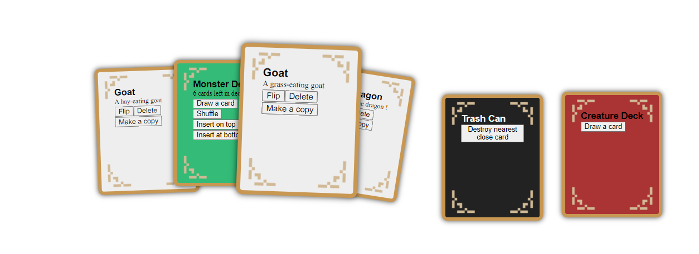

# Cartomancy.js



Cartomancy is a Javascript frontend library for designing card games and card games prototypes.
Cartomancy goes beyond the traditional 52 playing cards, you can have cards with the text you want.

You can find a cardgame example inside `hyperbolic_card_game.js`.
You can play this game with the `index.html` file.

`index.html` dynamically loads JavaScript to allow you to try out different games
without changing html files so that I only have to write the html template once!

You can find an simple example of how to use in `dummy.js`

## Getting started

Even if you don't want to program rules explicitly, cards can have a `copy` and `delete` button,
so that you can playtest games without having to program explicit rules or craft cards using paper.

```html

<div id="playgroud" style="width:100%;height:100%;"></div>

<script>

let game = new CardGame(playground);

let template = new CardTemplate("Red Dragon","An awesome dragon !");
let card = new VisibleCard(template, {flippable: false, copiable: true, deletable: true, movable: true});
card.rotation = 5;
card.backgroundColor = "red";
card.updateDomElement(); // update rotation and color on screen
game.addBoardElement(card);

</script>

```

Cartomancy suppports "Decks" which are stacks of cards (with a draw and insert at top/bottom functions) and "VirtualDeck" which can contain an infinite number of cards
and a new card is generated on draw.

For example, if you want a bank in your game from which players draw coin cards, you might use a virtual deck.


```js

// A regular deck
locationDeck.cardContent = locations;
locationDeck.x = 70; locationDeck.y = 30;
locationDeck.updateDomElement(); // update position on screen
locationDeck.shuffle();
game.addBoardElement(locationDeck);

// A virtual deck being added to a game object.
let coinTemplate = new CardTemplate("1 Gold","Represent a unit of currency");
let coinBank = new VirtualDeck("Gold Bank");
coinBank.backgroundColor = "#fd1";
coinBank.x = 150; coinBank.y = 30;
coinBank.drawCard = () => {return new VisibleCard(coinTemplate, {deletable: true})};
coinBank.updateDomElement();
game.addBoardElement(coinBank);

```

You can allow players to move cards, or not. You can customize every visual aspect of cards to create your own fantasy card game.

## Philosophy

- One file, cartomancy.js
- No dependencies
- No build step
- Add `<script src="cartomancy.js"></script>` to your project and start working!

## Documentation

Generate documentation using `jsdoc -d docs cartomancy.js`